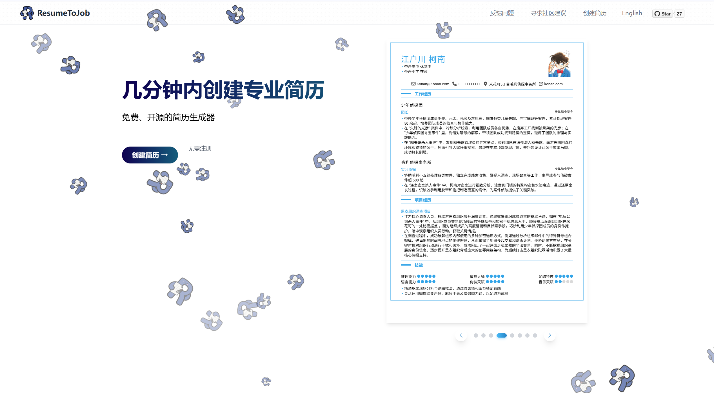
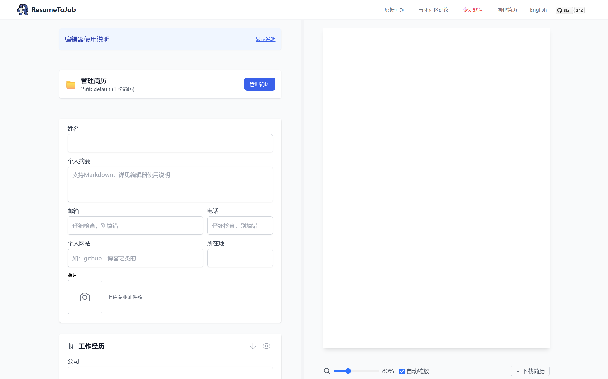
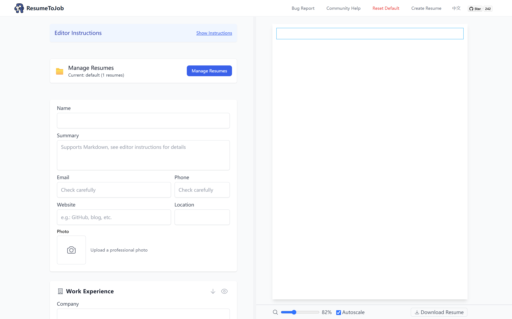

<div align="center">
  
</div>

# ResumeToJob | 简历制作网站

<div align="center">
  
</div>

<div align="center">

## [English](#english-version) | [简体中文](#chinese-version)

## 🔗

### [网站无法访问？没 🪜，等了好久还是无法访问，想本地部署，看此小白教程](DEPLOYMENT_TUTORIAL.md)

### [有 🪜，但还有问题？提交 Issue，帮助我们改进](https://github.com/ltlylfun/ResumeToJob/issues)

### [不知道如何写好简历？查看这份简历 tips](RESUME_TIPS.md)

### [还是不会写？需要建议？在讨论区提问【虽然没什么人:(，但我一定回复:)】或分享经验](https://github.com/ltlylfun/ResumeToJob/discussions/categories/resume-help)

<p align="center">
  <a href="https://github.com/ltlylfun/ResumeToJob/stargazers">
    
  </a>
  <a href="https://github.com/ltlylfun/ResumeToJob/network/members">
    
  </a>
  <a href="https://github.com/ltlylfun/ResumeToJob/issues">
    
  </a>
  <a href="https://github.com/ltlylfun/ResumeToJob/blob/main/LICENSE">
    
  </a>
</p>

<div align="center">
  
</div>

</div>

---

<a id="chinese-version"></a>

## 📋 简体中文

### 🚀 项目简介

ResumeToJob 是一个免费开源的在线简历制作工具，帮助求职者快速创建专业、美观的简历。支持多种模板选择、实时编辑、PDF 导出等功能，同时保护您的隐私数据安全。

### ✨ 主要特性

- 🎨 多种精美简历模板
- 📱 响应式设计，支持移动端和桌面端
- 🔒 注重隐私，所有数据存储在本地
- 📤 一键导出 PDF 格式简历
- 🌏 支持中英文界面
- 🖥️ 实时预览编辑效果
- ✏️ 支持 Markdown 格式，让内容编辑更简单

### 📝 Markdown 格式支持

<div align="center">
  
</div>

本项目支持 Markdown 格式，让您更轻松地编辑简历内容：

- **无序列表**：输入 `- ` 或 `* ` 创建无序列表（注意后面的空格）
- **有序列表**：输入 `1. ` 创建有序列表（注意后面的空格）
- **粗体文本**：输入 `**文本**` 或 `__文本__` 创建粗体文本

### 🤝 参与贡献

我们欢迎社区贡献者参与项目开发，特别是添加新的简历模板。请查看 [模板贡献指南](TEMPLATE_CONTRIBUTION.md) 了解如何创建和提交您的模板。

### 🔗 在线使用

访问 [https://resumetojob.ltlyl.fun/](https://resumetojob.ltlyl.fun/) 立即体验

备用链接：[https://resume-to-job.vercel.app/](https://resume-to-job.vercel.app/)

### 💻 本地开发

```bash
# 克隆项目
git clone https://github.com/ltlylfun/ResumeToJob.git

# 进入项目目录
cd ResumeToJob

# 安装依赖
npm install

# 启动开发服务器
npm run dev
```

启动后，访问 http://localhost:3000 查看网站

### 🛠️ 技术栈

- Next.js
- React
- TypeScript
- Tailwind CSS
- Redux Toolkit
- React PDF

### 📄 许可证

本项目使用 [AGPL-3.0 license](LICENSE)。

### 🙏 致谢

特别感谢项目 [open-resume](https://github.com/xitanggg/open-resume) 的创建者和所有贡献者。这个二次开发项目基于他们的杰出工作。

---

<a id="english-version"></a>

## 📋 English

### 🚀 Project Introduction

ResumeToJob is a free open-source online resume builder that helps job seekers quickly create professional, beautiful resumes. It supports multiple templates, real-time editing, PDF export, and ensures your privacy data security.

### ✨ Key Features

- 🎨 Multiple beautiful resume templates
- 📱 Responsive design for both mobile and desktop
- 🔒 Privacy-focused with all data stored locally
- 📤 One-click PDF export
- 🌏 Multi-language interface (English & Chinese)
- 🖥️ Real-time preview of edits
- ✏️ Markdown format support for easier content editing

### 📝 Markdown Format Support

<div align="center">
  
</div>

This project supports Markdown format to make resume content editing easier:

- **Unordered lists**: Type `- ` or `* ` to create unordered lists (note the space after)
- **Ordered lists**: Type `1. ` to create ordered lists (note the space after)
- **Bold text**: Type `**text**` or `__text__` to create bold text

### 🤝 Contribute

We welcome community contributors to participate in project development, especially adding new resume templates. Check out the [Template Contribution Guide](TEMPLATE_CONTRIBUTION.md) to learn how to create and submit your templates.

### 🔗 Online Usage

Visit [https://resumetojob.ltlyl.fun/](https://resumetojob.ltlyl.fun/) to get started

Alternative link: [https://resume-to-job.vercel.app/](https://resume-to-job.vercel.app/)

### 💻 Local Development

```bash
# Clone the repository
git clone https://github.com/ltlylfun/ResumeToJob.git

# Navigate to project directory
cd ResumeToJob

# Install dependencies
npm install

# Start development server
npm run dev
```

After starting, visit http://localhost:3000 to view the website

### 🛠️ Tech Stack

- Next.js
- React
- TypeScript
- Tailwind CSS
- Redux Toolkit
- React PDF

### 📄 License

This project is licensed under the [AGPL-3.0 license](LICENSE).

### 🙏 Acknowledgements

Special thanks to the creators and contributors of [open-resume](https://github.com/xitanggg/open-resume). This derivative project is based on their outstanding work.
